# Diyanet Web Modernization

## About

This repository contains a conceptual, full-stack public information portal. It demonstrates how an institutional site can present news, prayer times, Quran reading, hadith, fatwa search, sermons, publications, media, events, and 81 provincial office pages in one gateway.

The product is a **modular monolith**: a Next.js public website talks to a Spring Boot REST API backed by PostgreSQL.

## Important Notice

This is an independent conceptual modernization project and is not an official Diyanet website.

Live religious-service data uses public, documented APIs:

- Prayer times: [Aladhan](https://aladhan.com/prayer-times-api) with calculation method 13 (Diyanet)
- Quran Arabic + Turkish: [alquran.cloud](https://alquran.cloud/api) editions `quran-uthmani` and `tr.diyanet`
- Optional Bukhari sections: fawazahmed0 hadith-api via jsDelivr

News, fatwa, sermons, publications, events, and provincial office records are editorial CMS content for the portal. Fatwa answers are educational ilmihal summaries, not binding rulings. Provincial addresses and phone numbers are omitted unless a verified value exists. Worship and official citation still require primary sources.

## Features

- Institutional homepage with featured news, quick services, and live prayer times
- News listing, categories, pagination, article pages, and related articles
- Daily prayer times by province and district, next-prayer countdown, current-prayer highlight, monthly calendar
- Quran catalog (114 surahs) with Arabic text and Diyanet Turkish translation when the remote source is available
- Hadith archive, search, daily hadith, optional remote Bukhari sections
- Fatwa search, categories, detail, and related questions
- Sermons, publications, media, and events
- 81-province office template with map; contact fields only when verified
- Unified search page (`/arama`) and command palette (`Ctrl+K`)
- Contact form stored via `POST /api/contact`
- Turkish, English, and Arabic (RTL) via next-intl
- Accessibility controls: text size, contrast, underlined links, reduced motion
- JWT-protected admin area for demo news CRUD
- OpenAPI UI on the backend
- Docker Compose for PostgreSQL, API, and frontend

## Screenshots

Screenshots are taken from the running application (desktop 1440×900, mobile 390×844).

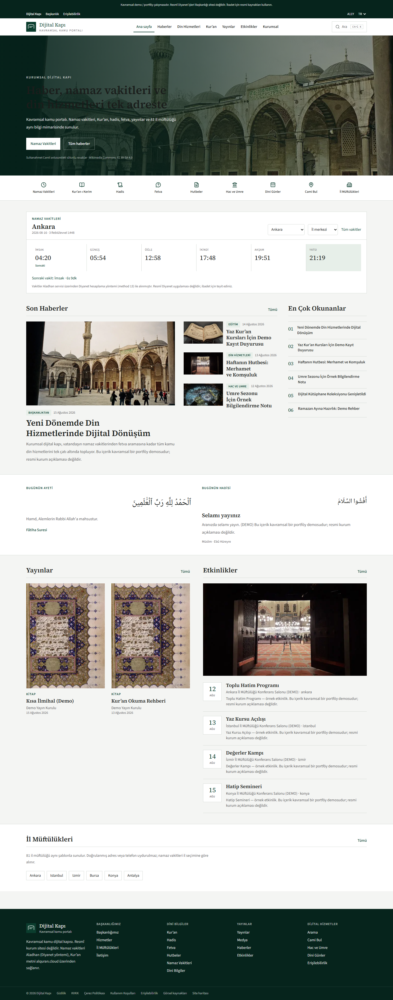

Desktop homepage: news, prayer times, and service shortcuts.

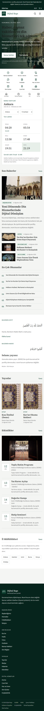

Mobile homepage with the bottom shortcut dock.


News listing with category chips.

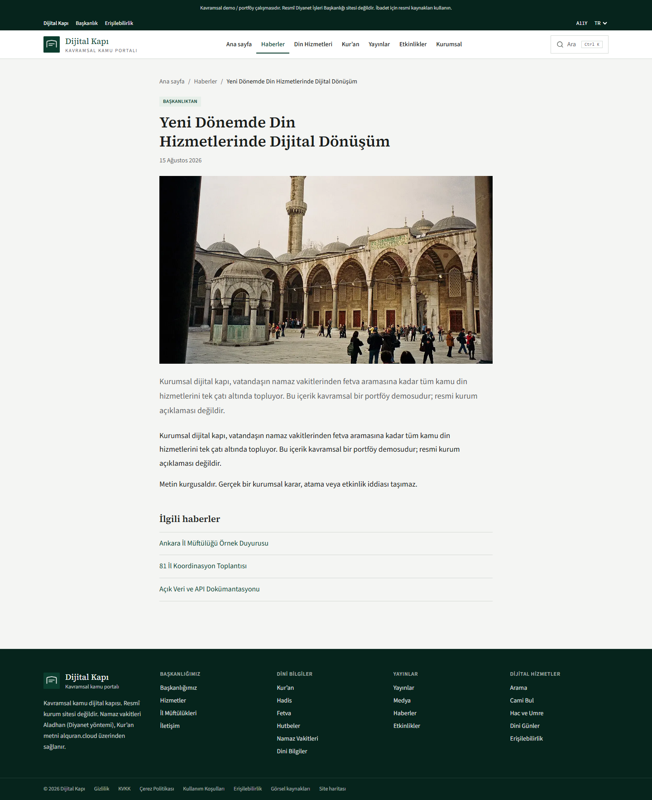

A single news article.

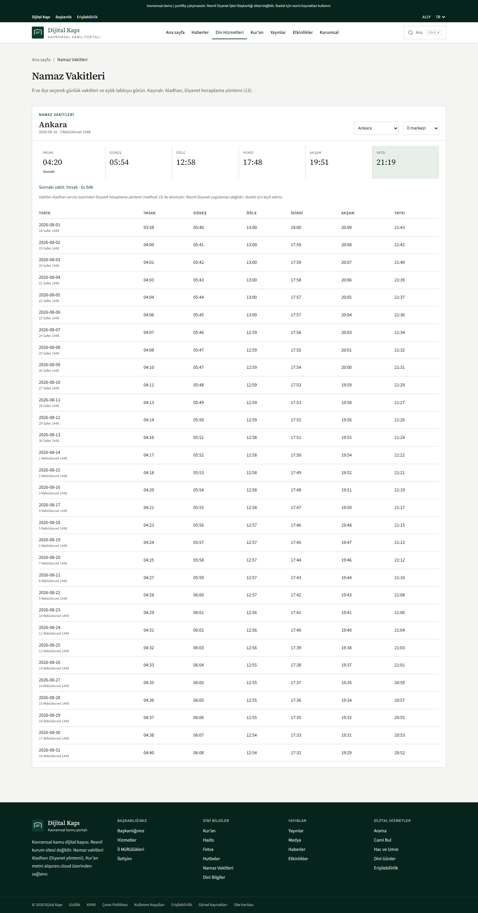

Daily prayer times by province.

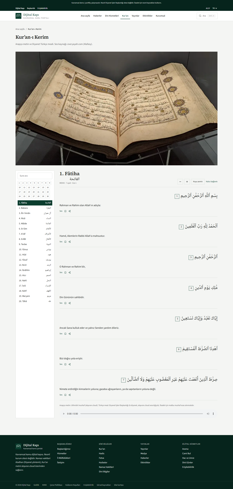

Quran reading interface.

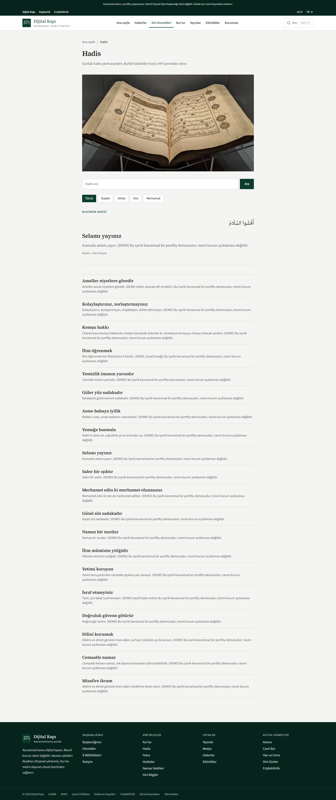

Hadith archive.

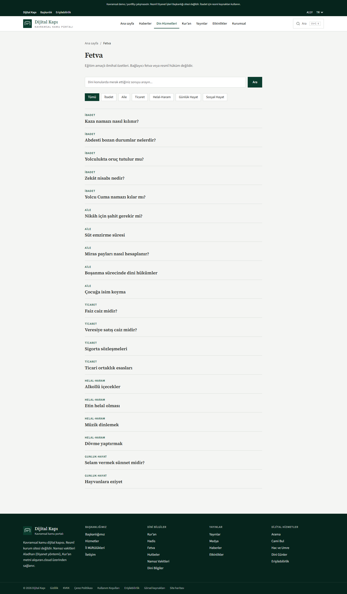

Fatwa search.

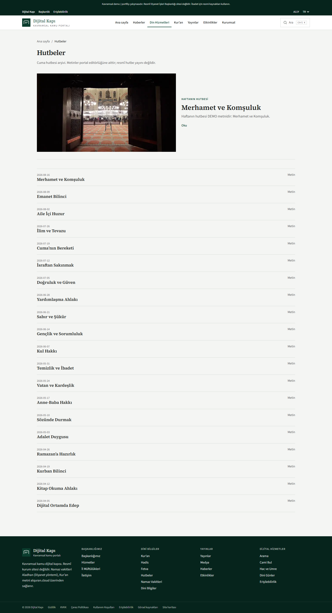

Sermon archive.

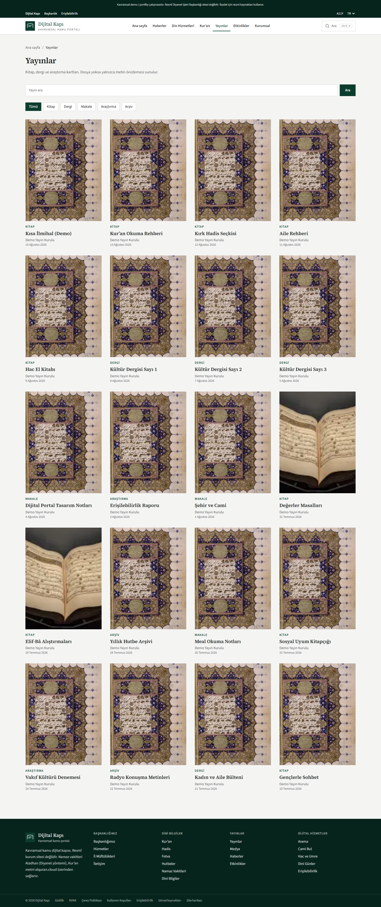

Publications listing.

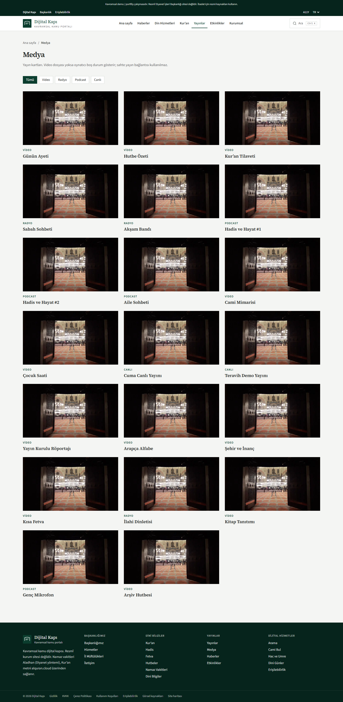

Media catalog.

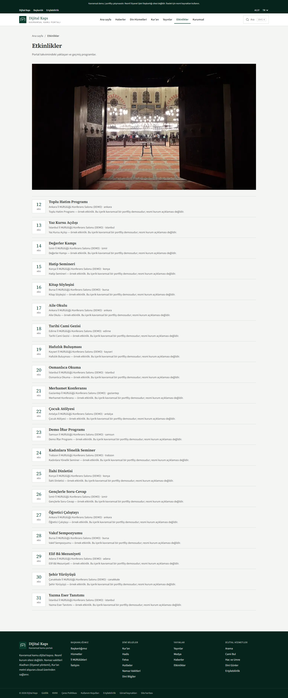

Events listing.

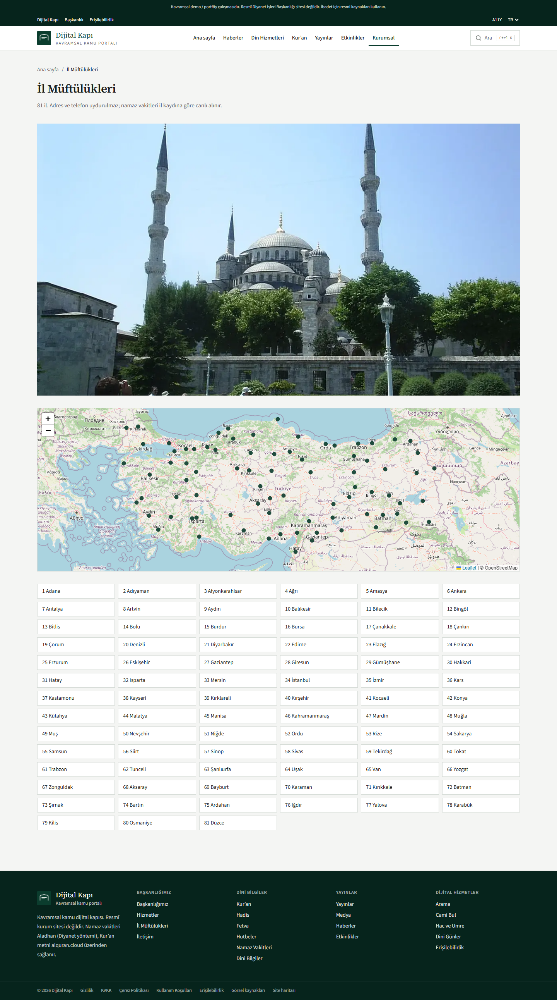

Provincial offices.

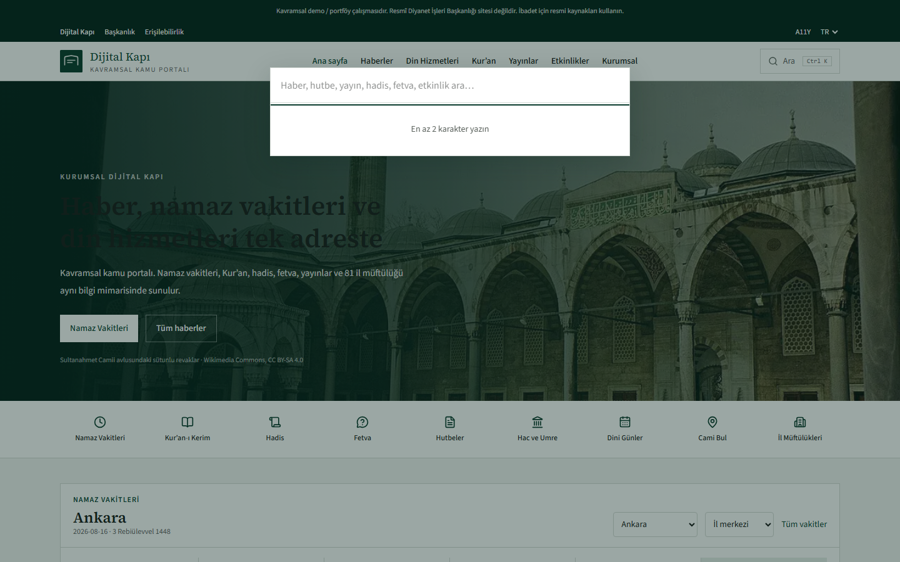

Command-palette search.

## Architecture

```
Browser
  → Next.js 16 (App Router, SSR/ISR, next-intl)
      → /api rewrite
          → Spring Boot 4 REST API
              → Module services (news, quran, prayer, search, …)
                  → Spring Data JPA repositories
                      → PostgreSQL 16 (Flyway)
```

Admin authentication uses JWT. Public `GET /api/**` endpoints are open. `/api/admin/**` requires `ADMIN` or `EDITOR`.

See [docs/architecture/architecture.svg](docs/architecture/architecture.svg).

## Tech Stack

| Layer | Technology |
| --- | --- |
| Frontend | Next.js 16, React 19, TypeScript, Tailwind CSS 4 |
| i18n | next-intl (`tr`, `en`, `ar`) |
| Client data | TanStack Query |
| Backend | Java 21, Spring Boot 4.0.7, Spring Security, Spring Data JPA |
| Database | PostgreSQL 16, Flyway |
| Auth | JWT (jjwt) |
| API docs | springdoc OpenAPI |
| Cache | Caffeine (Spring Cache) |
| Tests | Vitest, Playwright, JUnit / Spring Boot tests |
| Runtime | Docker Compose |

## Project Structure

```
.
├── backend/                 Spring Boot modular monolith
├── frontend/                Next.js App Router site
├── docs/architecture/       Architecture diagram
├── docs/screenshots/        Live UI screenshots
├── docker-compose.yml
├── .env.example
└── AUDIT_REPORT.md
```

## Frontend

- App Router routes live under `frontend/src/app/[locale]/(site)/`
- Admin UI lives under `frontend/src/app/[locale]/admin/`
- Shared UI is in `frontend/src/components/`
- Feature panels (prayer times, search, Quran reader) are in `frontend/src/features/`
- Server-side fetches use `API_INTERNAL_URL`; the browser uses relative `/api` (Next.js rewrite)

## Backend

Package root: `gov.diyanet.portal`.

Modules include authentication, content, quran, hadith, fatwa, sermon, publication, event, media, catalog, prayer, province, and search.

Each module follows Controller → Service → Repository. Flyway owns the schema (`V1__schema.sql`, `V2__indexes.sql`, `V3__contact_messages.sql`). External integrations live in `gov.diyanet.portal.integrations` and are toggled with environment flags. When `app.demo=true`, `DemoDataSeeder` loads editorial sample records and scrubs leftover placeholder images and fabricated contact fields.

## Database

PostgreSQL 16. Default local database/user names are listed in `.env.example`. Hibernate `ddl-auto` is `validate` in the main profile; tests use in-memory H2 with `create-drop`.

## API

- Base path: `http://localhost:8080/api`
- Health: `GET /api/health`
- OpenAPI: `http://localhost:8080/swagger-ui.html`
- Docs JSON: `/api/docs`

Representative public resources: `/api/news`, `/api/prayer-times`, `/api/prayer-times/calendar`, `/api/quran/surahs`, `/api/hadith`, `/api/fatwas`, `/api/sermons`, `/api/publications`, `/api/media`, `/api/events`, `/api/provinces`, `/api/search`, `/api/calendar/religious-days`, `POST /api/contact`.

## Authentication

- `POST /api/auth/login` returns a JWT
- Admin UI stores the token in `sessionStorage` for the browser tab
- CSRF is disabled because the API is stateless JWT
- Login attempts are rate-limited

A demo administrator is created only when `app.demo=true`. The seeded password lives in `DemoDataSeeder` and must be changed before any real deployment.

## Security

- Secrets belong in environment variables (`JWT_SECRET`, datasource credentials)
- CMS HTML is sanitized before render
- Security headers: `X-Content-Type-Options`, `X-Frame-Options`, `Referrer-Policy`, `Permissions-Policy`
- CORS origins are configurable
- Actuator exposes only `health` and `info`, without detail
- The public site is marked `noindex`

## Accessibility

- Skip link to main content
- Language switch and search controls have labels
- Search overlay uses a modal dialog (focus trap and Escape)
- Mobile menu exposes `aria-expanded`
- Reduced-motion preference is respected
- Arabic locale sets `dir="rtl"` after locale detection

## Performance

- Server Components for most public pages
- ISR/`revalidate` on catalog pages; prayer times use `cache: "no-store"` on the client and Caffeine (12h) on the API
- Local licensed Wikimedia photos stored as WebP under `frontend/public/images/` (see [docs/image-sources.md](docs/image-sources.md))
- Search queries are debounced; prayer/Quran/hadith remote calls are cached server-side
- Standalone Next.js output for Docker

## SEO

- Title template and Open Graph metadata
- Canonical base via `metadataBase` / `NEXT_PUBLIC_SITE_URL`
- JSON-LD on homepage and selected articles
- `robots.txt` disallows indexing (conceptual demo)
- `sitemap.ts` exists for URL inventory but is not advertised for crawlers

## Testing

Frontend:

```bash
cd frontend
npm test          # Vitest
npm run lint
npm run typecheck
npx playwright test
```

Backend:

```bash
cd backend
./mvnw test
```

## Local Development

PostgreSQL 16 must be reachable with the values in `.env.example`.

```bash
cd backend
./mvnw spring-boot:run

cd frontend
npm install
npm run dev
```

- Site: http://localhost:3000
- API: http://localhost:8080/api
- OpenAPI: http://localhost:8080/swagger-ui.html

## Environment Variables

Copy `.env.example` and set values locally. Do not commit `.env`.

| Variable | Used by | Purpose |
| --- | --- | --- |
| `JWT_SECRET` | backend | Signing key (use a long random value) |
| `SPRING_DATASOURCE_URL` | backend | JDBC URL |
| `SPRING_DATASOURCE_USERNAME` | backend | Database user |
| `SPRING_DATASOURCE_PASSWORD` | backend | Database password |
| `CORS_ORIGINS` | backend | Allowed browser origins |
| `API_INTERNAL_URL` | frontend | Server-side API base (Docker: `http://backend:8080`) |
| `NEXT_PUBLIC_SITE_URL` | frontend | Canonical site origin |
| `ALADHAN_ENABLED` | backend | Use Aladhan for prayer times and hijri calendar (`true` by default) |
| `ALADHAN_BASE_URL` | backend | Aladhan API base (`https://api.aladhan.com/v1`) |
| `ALQURAN_ENABLED` | backend | Use alquran.cloud for full surah text (`true` by default) |
| `ALQURAN_BASE_URL` | backend | alquran.cloud API base |
| `HADITH_API_ENABLED` | backend | Optional remote Bukhari sections |
| `HADITH_API_BASE_URL` | backend | jsDelivr hadith-api base |

## Docker

```bash
docker compose up --build
```

Services: `db` (5432), `backend` (8080), `frontend` (3000).

## API Documentation

Interactive docs: http://localhost:8080/swagger-ui.html after the backend is running.

## Known Limitations

- Aladhan method 13 approximates Diyanet calculation; it is not the official Diyanet application
- If Aladhan or alquran.cloud is disabled or unreachable, the API falls back to a local formula / partial catalog and the UI shows that source
- There is no official Diyanet news, fatwa, sermon, or mosque-coordinate API; those sections use CMS records or an honest empty state
- Fatwa answers are educational summaries, not binding rulings
- Provincial address/phone/email are blank unless a verified value is stored
- Media cards do not invent video URLs; the player shows an empty state when no file exists
- HTML sanitization is an allowlist/stripper, not a full HTML policy engine
- Default `html lang` is `tr` until the client locale helper runs
- Demo JWT default in `application.yml` is for local development only

## Future Improvements

- Official prayer-time confirmation against a primary Diyanet feed if one is published
- Mosque finder with licensed geo data
- Richer CMS with audited HTML policy and media upload scanning
- Remove unused frontend dependencies
- Server-rendered `lang`/`dir` on the root document
- Production secrets management and tighter login rate limits per deployment

## License

All rights reserved unless the repository owner adds a license file. This project is a conceptual portfolio/demo and is not affiliated with Diyanet İşleri Başkanlığı.
